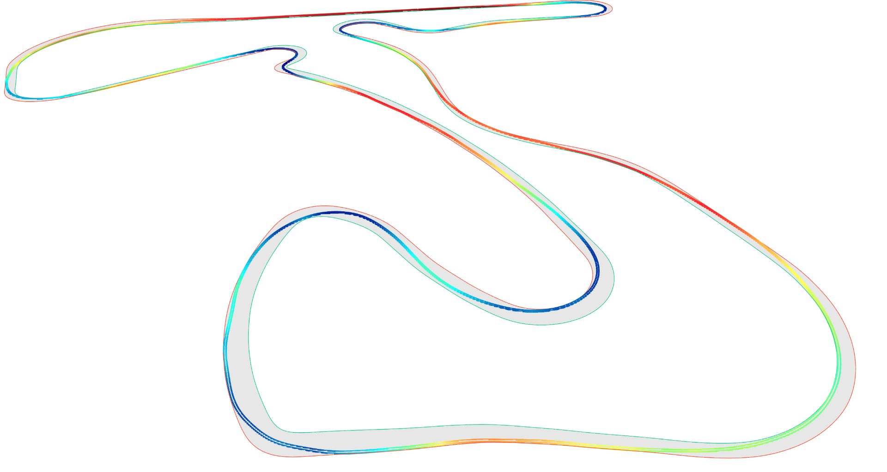

# Raceline


This repository contains:
1. A track fitting tool that generates a smooth and periodic racetrack from boundary points measured with noisy GPS or other methods. We formulate this as an Optimal Control Problem with CasADi.
2. A Lie physics-based minimum-lap-time optimizer to generate optimal raceline trajectories around any track. (In Development!)

# Track Generation Details
This repository implements, with some modifications, the track-fitting algorithm described in Peratoni and Limebeer's paper. Given two sets of noisy GPS boundary points, we fit a 3D smooth and differentiable ribbon model to the data that is suitable for use with minimum lap time optimization and other autonomous racing related algorithms.

# Usage
```python import.py [-h] --gpx_source GPX_SOURCE [--track_destination TRACK_DESTINATION] [--config CONFIG] [--plot]```

**Options**:

  ```-h```, ```--help```            shows a help message and exits

  ```--gpx_source GPX_SOURCE```
                        Source path to track gpx file.

  ```--track_destination TRACK_DESTINATION```
                        Destination path of fitted track.

  ```--config CONFIG```       Path to config file.

  ```--plot```                Toggles on plotting.
  
  ```--solver SOLVER```      IPOPT solver to use for the OCP. Default ```mumps```, ```ma97``` is recommended for speed.

The program outputs a .json file that contains data at each of the collocation points for the mesh segments of the track. To recover the track model itself, Barycentric (or Lagrange) interpolation must be performed within each interval on these collocation points.

# Track Data Generation
We recommend using Google Earth or Google Earth Pro to sample the track data. We use QGIS visualizer for elevation processing and export to the .gpx format. 

## Track Sampling
We only provide instructions for Google Earth.
1. Create two paths around either boundary of the track. Note that the outside edge of the track must be named "Outside" and the inside edge must be name "Inside".
2. Export the project as a ```.kmz``` or ```.kml``` file and import it into QGIS.

## GPX Generation
We only provide instructions for QGIS.
1. Locate or procure a sufficiently detailed DEM containing the region around the track, and add it to QGIS as a raster. Opentopography is a good source for these DEMs.
2. Open the QGIS toolbox, and search for "drape" tool. Set the input layer to be the imported ```.kml```/```.kmz``` file and the Raster Layer to the DEM. Run the operation.
3. Right click the new Draped object in the feature bar, select Export > Save Feature as...
4. Export the Drape as a ```.gpx``` file. We recommend exporting it to the ```import/gpx``` folder in this repository.

Note that, if you cannot obtain access to Opentopography, GPS visualizer is another good free software that can directly convert ```.kml``` and ```.kmz``` files to ```.gpx`` and inject elevation data. However, the accuracy of Opentopography DEMs is much higher, so we prefer to use QGIS.

## Implementation
We employ a custom modified version of Orthogonal Collocation with finite elements with hp-adaptive mesh refinement as described in Darby's dissertation. More details to come later.

# Minimum Lap Time Optimizer
We implement a Lie-based physics formulation based on the work of Bartali et al. using the Pinocchio Rigid Body Dynamics library. We model the race vehicle as a 6-DoF end effector, and compute all vehicle dynamics as wrenches to be applied to various joints of the vehicle. We opt to use the Recursive Newton-Euler Algorithm rather than the Articulated Body Algorithm (as used by Bartali et al.) for this project.

Vehicle information is stored in ```.yaml``` files in ```mlt/vehicle_properties```. Note that Pacejka tyre parameters are necessary for this optimizer. Dallara AV21/24 values from the Autonoma AWSIM project for the Indy Autonomous Challenge are currently provided as the default configuration.

**More general + usage documentation will be provided in the future; the optimizer formulation is still a work in progress.**

# References
```
Giacomo Perantoni and David JN Limebeer. Optimal control of a formula one car on a
three-dimensional track—part 1: Track modeling and identification. Journal of Dynamic
Systems, Measurement, and Control, 137(5):051018, 2015.
```
```
C. L. Darby, "Hp-Pseudospectral Method for Solving Continuous-Time Nonlinear Optimal
 Control Problems." Order No. 3467615, University of Florida, United States -- Florida, 2011.
```
```
Bartali, L., Gabiccini, M., Grabovic, E. et al. A reduced-order lie group-based race car model for systematic trajectory optimization on 3D tracks. Meccanica 58, 1869–1883 (2023). https://doi.org/10.1007/s11012-023-01708-8
```
